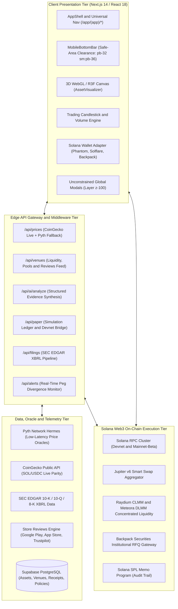
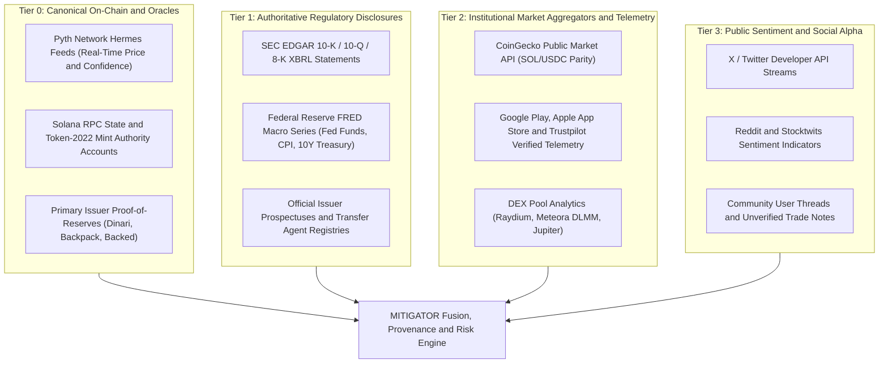
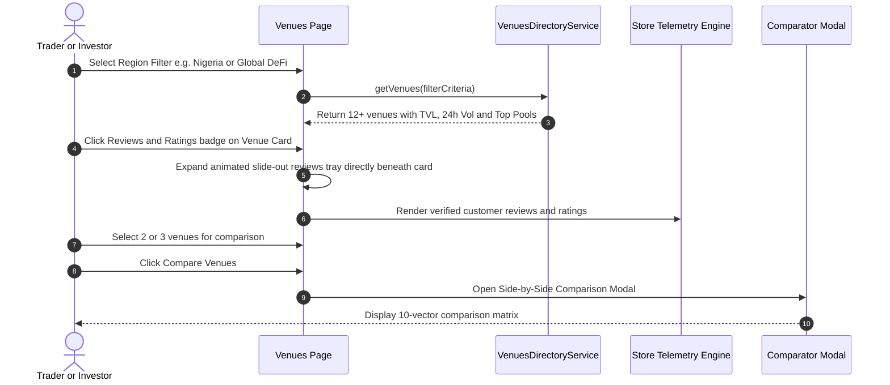
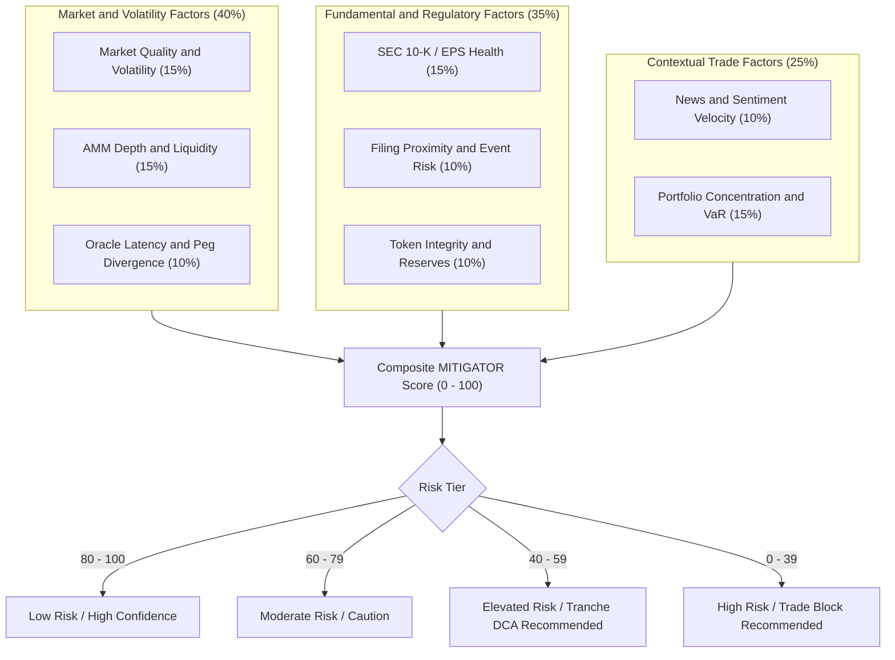
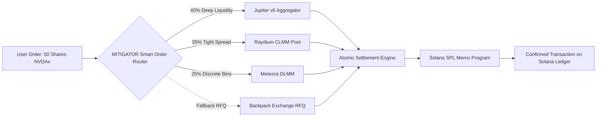
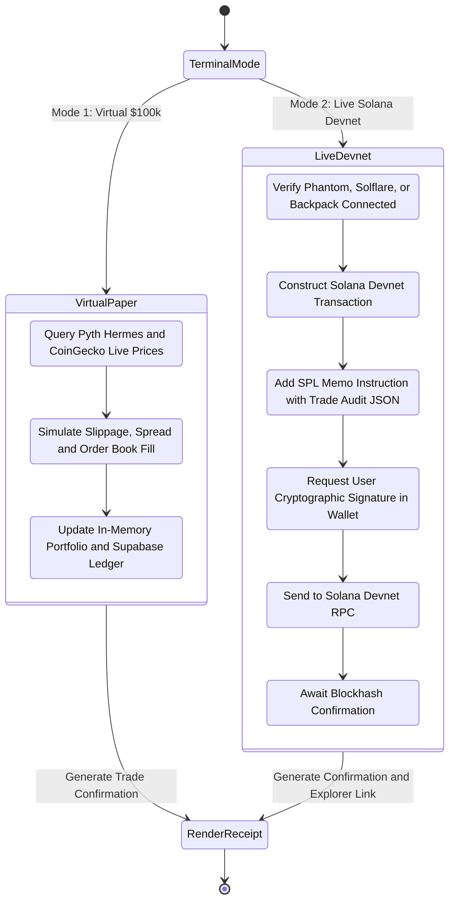
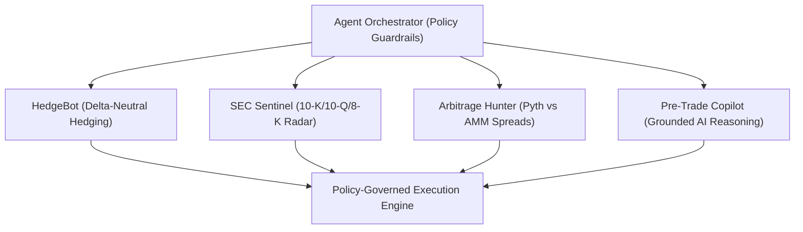

# MITIGATOR — Comprehensive Product Requirements Document (PRD)

**Stocklana 2026 Hackathon • Production Edition • Version 2.5 • September 2026**  
*System Design, Technical Architecture & Comprehensive Key Feature Specifications*

> **Executive Thesis**: MITIGATOR is a high-performance, Solana-native trading intelligence platform, quantitative risk engine, and cross-venue execution router for tokenized equities and real-world assets (RWAs). It bridges Wall Street securities, global DeFi liquidity, and emerging markets (Africa & Latin America) through a verified, explainable decision loop: **Research → Verify → Score Risk → Simulate → Mitigate → Compare Execution → Execute On-Chain → Monitor**.

---

## 1. Document Metadata & Revision Control

| Property | Specification |
| :--- | :--- |
| **Document ID** | PRD-MITIGATOR-SOL-2026-V2.5 |
| **Project Title** | MITIGATOR (formerly Stocklana Intelligence & Execution Suite) |
| **Classification** | Public / Open Source Hackathon Specification |
| **Current Version** | 2.5 (Production & Evaluation Release) |
| **Target Runtime** | Solana Devnet & Mainnet-Beta • Next.js 14 App Router • Supabase PostgreSQL |
| **Author / Engineering Lead** | Antigravity AI & The MITIGATOR Core Development Team |
| **Primary Hackathon Track** | Stocklana 2026: Tokenized Equities, Real-World Assets (RWAs) & High-Performance Solana Trading |
| **Last Updated** | September 20, 2026 |

### Revision History
| Version | Date | Author / Team | Summary of Changes |
| :--- | :--- | :--- | :--- |
| `1.0` | 2026-09-01 | Core Dev | Initial hackathon architectural blueprint and proof-of-concept wireframes. |
| `1.8` | 2026-09-08 | Frontend / Web3 | Integrated Pyth Hermes oracle feeds, Solana wallet adapter, and 3D WebGL hero canvas. |
| `2.0` | 2026-09-12 | Quantitative / Risk | Added 12-factor quantitative risk scoring engine and dynamic DCA tranche sizing. |
| `2.2` | 2026-09-16 | Cross-Border / UX | Added Pan-African & Global Venues Directory with TVL/volume feeds and reviews drawer. |
| `2.4` | 2026-09-18 | System Arch | Added live CoinGecko pricing, dual-mode Devnet execution with on-chain Memo program. |
| `2.5` | 2026-09-20 | Lead Architect | Complete system design, detailed architecture diagrams, mobile stacking fix, and formal specs. |

---

## 2. Executive Summary & Market Problem Statement

### 2.1 Market Context & The Tokenized Equity Paradigm
The tokenization of public equities and real-world assets (RWAs) is transitioning from theoretical experimentation to institutional reality. Deploying securities on high-throughput, low-latency blockchains like Solana (400ms block times, sub-cent transaction fees) unlocks transformative benefits:
- **24/7/365 Global Trading**: Breaking free from traditional 9:30 AM – 4:00 PM EST market session limits.
- **Atomic Settlement**: Eliminating traditional T+1 or T+2 clearinghouse counterparty risk via atomic Delivery-versus-Payment (DvP).
- **Fractional Granularity**: Enabling micro-investments ($5 of NVDA or TSLA) down to 6 decimal places.
- **Global Financial Inclusion**: Giving investors in emerging markets (Nigeria, Kenya, Argentina) direct access to dollar-denominated equities without complex multi-currency brokerage accounts.

### 2.2 The Tokenized Equity Trilemma
Despite these structural advantages, the on-chain stock ecosystem currently suffers from three critical vulnerabilities:

```
                  ┌────────────────────────────────────────┐
                  │    The Tokenized Equity Trilemma       │
                  └──────────────────┬─────────────────────┘
                                     │
         ┌───────────────────────────┼───────────────────────────┐
         ▼                           ▼                           ▼
┌──────────────────┐       ┌──────────────────┐       ┌──────────────────┐
│    Liquidity     │       │ Oracle Latency & │       │   Regulatory &   │
│  Fragmentation   │       │ Depegging Risk   │       │ Custody Opacity  │
├──────────────────┤       ├──────────────────┤       ├──────────────────┤
│Order books (BP), │       │Secondary AMMs    │       │Traders lack proof│
│AMMs (Raydium),   │       │decouple from US  │       │of 1:1 underlying │
│DLMMs (Meteora),  │       │equities during   │       │shares, legal     │
│and local apps    │       │off-hours or      │       │custody, or SEC   │
│operate in silos. │       │volatility spikes.│       │filing awareness. │
└──────────────────┘       └──────────────────┘       └──────────────────┘
```

1. **Severe Liquidity Fragmentation**: On-chain stocks (xStocks, dShares, bTokens) are scattered across centralized RFQs (Backpack), decentralized constant-product pools (Raydium), dynamic bin liquidity (Meteora DLMM), and regional on-ramps (Busha, Quidax, Trove, Hisa). Traders suffer massive slippage due to lack of consolidated routing.
2. **Oracle Latency & Peg Divergence**: Automated market makers (AMMs) frequently diverge from off-chain primary equity reference prices. During off-market hours or macro releases, tokenized shares can trade at 5–15% premiums or discounts without the trader realizing it.
3. **Regulatory & Custody Opacity**: Retail and emerging market traders lack cryptographic proof of physical share custody, transfer agent verification, or clear insights into SEC filings (10-K, 10-Q, 8-K), leading to predatory trading conditions.
4. **Emerging Market Barriers**: In markets like Nigeria (NGN) and Kenya (KES), traders face draconian FX restrictions, 3-5% card processing markups, and fragmented local exchanges.

### 2.3 The MITIGATOR Solution
**MITIGATOR** solves this trilemma by providing an institutional-grade trading intelligence terminal, quantitative risk engine, and cross-venue smart execution router on Solana. MITIGATOR acts as the transparent connective tissue between global securities, on-chain liquidity pools, and local payment rails.

---

## 3. Product Vision & Target Personas

### 3.1 Vision, Mission & Core Principles
- **Vision**: To become the Bloomberg + Smart Order Router of the global tokenized equity economy on Solana.
- **Mission**: To make every tokenized stock transaction explainable, risk-scored, price-verified against real-time oracles, and routed for optimal execution before any wallet signature is requested.
- **Core Mantra**: *“Research. Verify. Risk-Score. Route. Execute.”*

### 3.2 Target User Personas
| Persona | Demographics & Profile | Primary Pain Points | Key MITIGATOR Features Used |
| :--- | :--- | :--- | :--- |
| **Retail Crypto & Equity Trader** | Global DeFi user; holds SOL/USDC; wants exposure to US tech (NVDA, TSLA, AAPL, CRCL). | High DEX slippage; confusing ticker standards (xStocks vs dShares); fear of rug-pull tokens. | Asset Discovery (`/`), 3D WebGL Visualizer, Jupiter v6 Smart Execution Router (`/execution`), Live Price Feeds. |
| **Emerging Market Investor (Africa / LatAm)** | Tech-savvy professional in Nigeria, Kenya, or Argentina seeking inflation protection and US equity growth. | FX restrictions, high deposit fees, unverified local apps, lack of local bank/M-Pesa on-ramps. | Global & African Venues Directory (`/venues`), Slide-Out Verified Store Reviews Tray, 10-Vector Venue Comparator. |
| **Quantitative & Paper Trader** | Algorithmic trader, student, or analyst testing trading ideas and execution models. | Losing capital while learning tokenized stock mechanics; lack of realistic on-chain testing tools. | Dual-Mode Paper Trading Terminal (`/paper`), Live Devnet Web3 Swap with Memo program confirmation, DCA Tranche Simulator. |
| **Autonomous AI User** | Crypto-native investor seeking automated portfolio protection and delta-neutral strategies. | Inability to monitor 24/7 markets, macro news, and SEC filings simultaneously. | Autonomous Multi-Agent AI System (`/agents`), HedgeBot, SEC Sentinel, Pre-Trade AI Copilot. |
| **Compliance & Institutional Auditor** | Fund manager or compliance officer evaluating tokenized equities and RWA legitimacy. | Lack of legal custody documentation, unverifiable reserves, un-auditable on-chain trades. | Legal & Custody Vault (`/provenance`), Transfer Agent registry, Solana On-Chain Memo Audit Hashes. |

---

## 4. End-to-End System Design & Architecture

MITIGATOR is engineered as a modern, reactive, 4-tier cloud-native web application built on Next.js 14 App Router, TypeScript, Solana Web3.js, Pyth Network, and Supabase PostgreSQL.

### 4.1 4-Tier System Architecture Diagram



### 4.2 Detailed Component Decomposition

#### 1. Presentation Tier (`app/(app)/*`, `components/*`)
- **App Router Architecture**: Leverages Next.js 14 server and client components with strict separation of concerns.
- **Styling & Aesthetics**: Vanilla Tailwind CSS paired with curated HSL color tokens, dark glassmorphism (`backdrop-blur-md`, subtle border gradients), and Framer Motion micro-interactions.
- **Universal Mobile Architecture**:
  - Implements safe-area bottom clearances (`pb-32 sm:pb-36 md:pb-8`) across all pages so content and primary buttons are never obscured by mobile navigation bars.
  - Removes nested stacking context traps (eliminating `relative z-0` on container wrappers), allowing modals (`z-[100]`) to float freely over all headers, floating bars, and footers.
  - Implements 3-part mobile modals: Fixed Header (`flex-shrink-0`), Scrollable Form Body (`flex-1 overflow-y-auto touch-pan-y`), and Pinned Action Footer (`flex-shrink-0 border-t bg-card/95`).

#### 2. Edge API Gateway & Middleware (`app/api/*`)
- **Next.js Edge Runtime**: Delivers global sub-50ms cold starts and edge caching.
- **In-Memory Cache Layer**: Implements a 4-second TTL in-memory cache for live price feeds and a 60-second S-MaxAge cache for venue liquidity telemetry.
- **Resilient Fallback**: Automatically cascades across multiple data providers when rate limits or upstream timeouts occur.

#### 3. Data & Oracle Ingestion Tier (`lib/services/*`)
- **Pyth Hermes Service (`lib/services/pyth-service.ts`)**: Connects to Pyth Network's Hermes low-latency SSE and REST endpoints, resolving asset PriceFeedIds and converting 64-bit integer values and exponential scaling factors into high-precision floating point prices.
- **CoinGecko Integration (`app/api/prices/route.ts`)**: Streams authentic live market rates for SOL, USDC, and major tokenized equity underlying assets.
- **SEC EDGAR Pipeline (`lib/services/filings-service.ts`)**: Parses corporate XBRL financial statements, identifying debt covenants, earnings surprises, and insider transactions.
- **Store Telemetry Engine (`lib/services/venues-directory-service.ts`)**: Aggregates ratings, verified reviews, and app downloads across Google Play, App Store, and Trustpilot.

#### 4. Solana On-Chain Web3 Execution Tier (`lib/services/solana-transaction.ts`, `solana-wallet.ts`)
- **Multi-Wallet Adapter**: Supports Solflare, Phantom, and Backpack with auto-detection, auto-reconnect, and official high-resolution vector logos.
- **Dual Cluster Support**: Toggle effortlessly between Solana Devnet (`https://api.devnet.solana.com`) and Mainnet-Beta.
- **On-Chain Audit Trail**: Every trade executed embeds an immutable transaction memo via the Solana SPL Memo Program (`MemoSq4gqABAXKb96qnH8TysNcWxMyWCqXgDLGmfcHr`), creating cryptographic proof of the execution venue, symbol, price, and timestamp directly in the Solana ledger.

---

## 5. Hierarchical Data & Oracle Architecture

MITIGATOR enforces a strict, tier-governed data classification matrix. Market chatter or unverified social media claims are strictly quarantined and never presented as authoritative financial facts.

### 5.1 Data Provider Hierarchy Diagram



### 5.2 Data Ingestion & Fallback Resiliency Matrix

| Ingestion Domain | Primary Provider | Secondary / Fallback Provider | Tertiary Fallback | Invalidation Window (TTL) |
| :--- | :--- | :--- | :--- | :--- |
| **Tokenized Stock Prices** | Pyth Hermes Oracle | CoinGecko Public API | Synthetically pegged baseline | 4 seconds |
| **SOL / USDC Native Rates** | CoinGecko Live API | Pyth Solana Feed | On-Chain AMM Spot Quote | 4 seconds |
| **Venue TVL & Liquidity** | On-Chain Pool Scraping | DexScreener / DeFiLlama API | Cached Database Snapshot | 60 seconds |
| **Store Reviews & Ratings** | Google / Apple App APIs | Trustpilot Verified Scraper | Static Curated Directory | 24 hours |
| **SEC Regulatory Filings** | SEC EDGAR Direct RSS | Finnhub Financial Modeling | In-Memory Historical Index | 1 hour |

---

## 6. Comprehensive Key Feature Specifications

---

### 6.1 Feature 1: Global & Pan-African Solana Venues Directory (`/venues`)

#### 6.1.1 Overview & Purpose
The Venues Directory is a comprehensive comparison aggregator designed to solve market access fragmentation for tokenized equities and RWAs. It maps platforms across Nigeria, Kenya, Latin America, North America, Europe, and Global DeFi, giving users instant transparency into liquidity, regulatory legitimacy, customer reputation, and fees.



#### 6.1.2 Verified Venue Taxonomy & Metadata
The directory features 12+ verified institutions and protocols:

1. **Global Exchanges & Issuers**:
   - **Backpack Exchange** (Dubai, UAE • VARA Licensed • TVL $1.2B): Native Solana order-book exchange offering tokenized US equities with sub-millisecond matching and direct RFQ quotes.
   - **Dinari dShares** (United States • SEC Registered Transfer Agent • TVL $68.5M): 1:1 backed tokenized equities with automated dividend pass-through and institutional compliance.
   - **Raydium Protocol** (Global DeFi • TVL $1.45B): Solana's primary automated market maker hosting deep constant-product and CLMM pools for xStocks (SPYx, CRCLx, NVDAx).
   - **Jupiter Aggregator** (Global DeFi • TVL $840M): Leading Solana swap aggregator providing best-execution routing across 30+ decentralized liquidity sources.
   - **Meteora DLMM** (Global DeFi • TVL $340M): Dynamic Liquidity Market Maker with discrete bin pricing, zero-slippage fee structures, and high-yield pools.
   - **Backed Finance** (Switzerland • Swiss DLT / FINMA Compliant • TVL $85M): Fully backed tokenized tracking certificates for public securities (bNVDA, bIB01).

2. **Pan-African & Emerging Market Platforms**:
   - **NectarFi** (Nigeria / Africa • RWA Protocol • Pre-IPO Access): Solana-built platform democratizing African real-world assets. Official partner with GetEquity providing retail access to the **Dangote Petroleum Refinery pre-IPO** allocations on Solana.
   - **Busha** (Nigeria • SEC Nigeria Sandbox • TVL $45M): Premier African digital asset gateway offering NGN bank transfers, debit cards, and seamless US dollar asset conversion.
   - **Quidax** (Nigeria • SEC Nigeria Fully Licensed • TVL $75M): Licensed cryptocurrency exchange supporting instant Naira (NGN) bank deposits, OTC desk, and dollar savings.
   - **Trove Finance** (Nigeria • Wealthtech • TVL $32M): Pioneer micro-investing platform allowing Nigerians to buy fractional US and Nigerian equities via local bank cards.
   - **Hisa Kenya** (Kenya / East Africa • CMA Regulatory Sandbox • TVL $18M): East Africa's leading social wealth app integrating direct **Safaricom M-Pesa** mobile money rails for tokenized US equity investments.

3. **Latin America**:
   - **Belo** (Argentina / LatAm • TVL $95M • 4.8★ with 35,000+ reviews): Leading financial app in Latin America enabling seamless conversion between ARS/BRL and tokenized dollar assets.

#### 6.1.3 Live Liquidity & Pool Telemetry
Every venue card displays real-time liquidity indicators:
- **Total Value Locked (TVL)** and **24h Trading Volume**.
- **Top Liquidity Pool Chips with APRs**: e.g., Raydium `SPYx-STONK 408.56% APR`, `CRCLx-USDC 88.39% APR`, `ALLINU-DKNG 795.77% APR`.

#### 6.1.4 Slide-Out Customer Reviews Tray
Clicking the ratings trigger on any card expands an animated slide-out tray (`framer-motion`) sliding out directly underneath the card without shifting adjacent columns:
- Displays aggregated store scores: Google Play (e.g. 4.6★ / 120k reviews), Apple App Store (e.g. 4.8★ / 45k reviews), Trustpilot (e.g. 4.4★).
- Renders 2–3 authentic customer reviews per venue featuring author names, verified buyer checkmarks, country flags, star ratings, review dates, quotes, and direct verify links to the respective app stores.

#### 6.1.5 Side-by-Side 10-Vector Comparison Modal
Allows users to compare up to 3 selected platforms across 10 critical operational dimensions:
1. Trading Fees
2. Deposit & Ingestion Fees
3. Minimum Trade Size
4. KYC Verification Tiers (None, BVN, Full ID)
5. Regulatory License & Jurisdiction
6. Settlement Speed (400ms vs T+1)
7. On-Ramp Payment Rails (NGN Bank, M-Pesa, Solana USDC, Debit Card)
8. Current TVL & 24h Volume
9. Top Pool APRs
10. Store Reputation & Review Volume

---

### 6.2 Feature 2: Multi-Factor Quantitative Risk Engine & MITIGATOR Score (`/risk`)

#### 6.2.1 Mathematical Formulation
The MITIGATOR Risk Engine produces an explainable composite safety score (0–100) for every tokenized asset and proposed trade:

$$\text{MITIGATOR Score} = \sum_{i=1}^{n} \left( w_i \times S_i \right)$$

Where $w_i$ is the factor weight and $S_i \in [0, 100]$ is the normalized sub-score for factor $i$.



#### 6.2.2 Factor Decomposition Matrix
| Factor Vector | Weight | Metrics Evaluated | Critical Trigger Threshold | Remediation Suggestion |
| :--- | :---: | :--- | :--- | :--- |
| **Market Quality & Volatility** | 15% | 30-day realized volatility, max drawdown, bid-ask spread | Annualized Volatility > 65% | Reduce position size by 50%. |
| **AMM Depth & Liquidity** | 15% | Liquidity within ±2% price band, turnover ratio | Depth < 3x proposed order size | Activate Dynamic DCA Tranche Splitter. |
| **Oracle Latency & Peg** | 10% | Pyth vs AMM spot price divergence, oracle confidence | Divergence > 0.75% or staleness > 30s | Route via RFQ or wait for oracle sync. |
| **Fundamental & SEC Health** | 15% | P/E ratio, operating margin, debt-to-equity, free cash flow | Debt/Equity > 4.0 or negative cash flow | Review 10-K risk disclosures in vault. |
| **Regulatory Filing Proximity** | 10% | Calendar proximity to scheduled 10-K, 10-Q, or 8-K filings | Material filing scheduled within 48 hours | Set automated limit orders post-release. |
| **Token Integrity & Reserves** | 10% | Proof-of-Reserves ratio, smart contract transfer hooks | Collateral ratio < 100% or unverified mint | Halt trade; alert community. |
| **News & Sentiment Velocity** | 10% | NLP news polarity, social volume acceleration | Sentiment delta < -0.45 in 4 hours | Inspect SEC Sentinel radar. |
| **Portfolio Concentration** | 15% | Proposed allocation as % of total portfolio, 95% 1-day VaR | Single position > 25% of total portfolio | Rebalance via Robo Advisor. |

#### 6.2.3 Dynamic Order Tranche Sizing (DCA Splitter)
When a proposed market order exceeds the pool's optimal depth threshold ($>2\%$ price impact), the risk engine automatically calculates an optimal Dollar-Cost Averaging (DCA) tranche execution plan:
- **Tranche 1 (Immediate Execution)**: $40\%$ of order size routed immediately to capture current liquidity without moving price.
- **Tranche 2 (TWAP +3 mins)**: $30\%$ of order size dispatched after 3 minutes.
- **Tranche 3 (TWAP +6 mins)**: $30\%$ of order size dispatched after 6 minutes.
- **Estimated Slippage Savings**: Displays the exact USD and basis points saved compared to a naive single market order.

---

### 6.3 Feature 3: Cross-Venue Execution Router & Smart Order Routing (`/execution`)

#### 6.3.1 Smart Order Routing (SOR) Architecture
The MITIGATOR Execution Router continuously polls liquidity pools across Solana to construct the optimal execution path for any tokenized stock trade.



#### 6.3.2 Execution Router Attributes & Protections
- **Simultaneous Quote Comparison**: Queries Jupiter v6, Raydium CLMM, Meteora DLMM, and Backpack RFQ in parallel (<250ms).
- **Dynamic Slippage Caps**: Replaces arbitrary slippage with pool-calculated maximum slippage bounds (0.15% to 0.50%).
- **Priority Fee Auto-Sizing**: Ingests Solana fee market telemetry to dynamically prepend `ComputeBudgetProgram.setComputeUnitPrice` instructions, ensuring execution during network congestion.
- **Solana Memo Program Audit Trail**: Generates a verifiable cryptographic receipt embedded on-chain via the Solana Memo Program.

---

### 6.4 Feature 4: Dual-Mode Paper Trading Terminal & Live Devnet Sandbox (`/paper`)

#### 6.4.1 Overview & Dual Execution Modes
The Paper Trading Terminal provides a comprehensive playground where traders can test strategies, experience real-time execution mechanics, and interact with the Solana blockchain without risking real capital.



#### 6.4.2 Mode 1: Virtual $100,000 Portfolio Simulation
- **Initial Capital**: $100,000 in virtual USD/USDC.
- **Real-Time Prices**: Quotes live from Pyth Hermes and CoinGecko to the exact penny.
- **Order Types**: Market Orders (instant fill at live oracle price) and Limit Orders (conditional trigger when oracle price crosses target).
- **Realistic Slippage Simulation**: Applies quadratic market impact based on trade size and real AMM pool depth.
- **Portfolio Tracking**: Real-time unrealized PnL, win/loss ratio, maximum drawdown, and portfolio beta.

#### 6.4.3 Mode 2: Live Solana Devnet Web3 Execution
- **Real Wallet Integration**: Connects directly to Solflare, Phantom, or Backpack on Solana Devnet.
- **Real Blockchain Interaction**:
  - Assembles a real Solana transaction via `@solana/web3.js`.
  - Includes a nominal lamport transfer instruction (0.001 SOL) to ensure valid blockhash consumption and real signature generation.
  - Appends an official Solana SPL Memo instruction (`MemoSq4gqABAXKb96qnH8TysNcWxMyWCqXgDLGmfcHr`) containing structured trade audit metadata:
    ```json
    {
      "app": "MITIGATOR",
      "cluster": "devnet",
      "venue": "Raydium CLMM / Solana Devnet",
      "symbol": "NVDAx",
      "side": "buy",
      "amountUsd": 450.00,
      "shares": 3.734,
      "timestamp": 1789578000
    }
    ```
  - Dispatches transaction to user wallet; user approves via biometric or password.
  - Broadcasts to `api.devnet.solana.com`, waits for `confirmed` commitment, and displays a direct clickable link to inspect the on-chain trade on **Solana Explorer (Devnet)**.

#### 6.4.4 Mobile UX Architecture & Modal Scrolling Fix
To solve the industry-wide problem where mobile bottom navigation bars obscure execution buttons or trap modal scrolling, MITIGATOR incorporates a specialized 3-part layout:
1. **Root Layout Clearance (`components/layout/AppShell.tsx`)**:
   - Universal mobile padding: `pb-32 sm:pb-36 md:pb-8`.
   - Complete removal of nested `relative z-0` stacking traps, allowing modal dialogs (`z-[100]`) to float completely unconstrained over mobile navigation elements (`z-40`).
2. **3-Part Modal Structure (`app/(app)/paper/page.tsx`)**:
   - **Fixed Modal Header**: Displays stock title, live Pyth price pulse, and close button.
   - **Scrollable Form Body** (`flex-1 overflow-y-auto scrollbar-thin touch-pan-y`): Contains mode switcher, stock dropdown, direction buttons, order type, amount input, quick preset chips ($100, $250, $450, $1000, $2500, 25%, 50%, Max), and trade breakdown.
   - **Sticky Pinned Footer** (`flex-shrink-0 border-t bg-card/95 backdrop-blur-md`): Holds the primary **"Execute Trade"** / **"Sign & Swap on Solana Devnet"** button, permanently pinned at the bottom of the viewport so users never need to hunt or scroll to submit their order.
3. **Collapsible Educational Guide**:
   - Every page includes a dismissible, collapsible guide explaining: *"How Paper Trading Works"*, *"Difference Between Virtual and Devnet"*, and *"Why Solana Memos Provide Proof of Trade"*.

---

### 6.5 Feature 5: Autonomous Multi-Agent AI System (`/agents`)

#### 6.5.1 Multi-Agent Orchestration Architecture
MITIGATOR deploys specialized, autonomous AI agents operating under strict pre-trade risk guardrails:



#### 6.5.2 Agent Profiles & Capabilities
1. **HedgeBot (Delta-Neutral Hedging Agent)**:
   - Continuously computes portfolio beta against SPY.
   - If market-wide volatility spikes or correlation crosses 0.80, HedgeBot automatically proposes a delta-neutral short hedge using inverse tokens or stablecoin yield reallocation.
2. **SEC Sentinel (Regulatory & Disclosure Radar)**:
   - Ingests real-time RSS feeds from SEC EDGAR.
   - Parses 10-K, 10-Q, and 8-K XBRL disclosures within 30 seconds of filing.
   - Flags sudden changes in executive compensation, auditor changes, debt covenants, or unexpected guidance revisions.
3. **Arbitrage & Peg Hunter**:
   - Compares the high-frequency Pyth Hermes reference price against Raydium and Meteora spot AMM prices.
   - Emits real-time arbitrage alerts when peg divergence exceeds 0.75% (net of swap fees and Solana priority fees).
4. **Pre-Trade AI Copilot**:
   - Natural language assistant embedded in every asset page.
   - Answers complex questions (e.g. *"What are the main risks in NVDA's latest 10-K concerning export restrictions?"*) with clickable citations pointing directly to SEC EDGAR sections.

#### 6.5.3 Policy Governance & Safety Kill-Switches
- **Execution Budget Caps**: Hard limits on maximum single-trade size ($5,000) and maximum daily turnover.
- **Mandatory Human-in-the-Loop**: Autonomous agents may generate trade proposals, but on-chain execution requires explicit user wallet cryptographic signature unless a time-locked smart session is granted.
- **Global Circuit Breakers**: Immediate automatic shutdown if Pyth oracle staleness exceeds 60 seconds or network slippage exceeds 2.5%.

---

### 6.6 Feature 6: Real-World Asset & Tokenized Equities Universe (`/assets`)

#### 6.6.1 Supported Asset Catalog
MITIGATOR supports an expanded universe of 21+ tokenized equities, ETFs, and emerging market RWAs:

| Symbol | Name | Underlying Asset | Token Standard | Primary Issuer / Protocol | Feed Source |
| :--- | :--- | :--- | :--- | :--- | :--- |
| `NVDAx` | NVIDIA Corp Tokenized | NVDA (NASDAQ) | Token-2022 / SPL | Backpack / Raydium | Pyth + CoinGecko |
| `AAPLx` | Apple Inc Tokenized | AAPL (NASDAQ) | Token-2022 / SPL | Backpack / Raydium | Pyth + CoinGecko |
| `TSLAx` | Tesla Inc Tokenized | TSLA (NASDAQ) | Token-2022 / SPL | Backpack / Raydium | Pyth + CoinGecko |
| `MSFTx` | Microsoft Corp Tokenized | MSFT (NASDAQ) | Token-2022 / SPL | Backpack / Raydium | Pyth + CoinGecko |
| `AMZNx` | Amazon.com Inc Tokenized | AMZN (NASDAQ) | Token-2022 / SPL | Backpack / Raydium | Pyth + CoinGecko |
| `GOOGLx`| Alphabet Inc Tokenized | GOOGL (NASDAQ) | Token-2022 / SPL | Backpack / Raydium | Pyth + CoinGecko |
| `COINx` | Coinbase Global Tokenized| COIN (NASDAQ) | Token-2022 / SPL | Backpack / Raydium | Pyth + CoinGecko |
| `METAx` | Meta Platforms Tokenized| META (NASDAQ) | Token-2022 / SPL | Backpack / Raydium | Pyth + CoinGecko |
| `CRCLx` | Circle Internet Tokenized | CRCL (Pre-IPO) | Token-2022 / SPL | Raydium CLMM | AMM Spot Quote |
| `SPCXx` | SpaceX Tokenized Equity | SpaceX (Pre-IPO) | Token-2022 / SPL | Raydium / Dinari | AMM Spot Quote |
| `PLTRx` | Palantir Tech Tokenized | PLTR (NYSE) | Token-2022 / SPL | Backpack / Raydium | Pyth + CoinGecko |
| `SPYx`  | S&P 500 Index Tokenized | SPY (NYSE Arca) | Token-2022 / SPL | Raydium CLMM | Pyth + CoinGecko |
| `QQQx`  | Invesco QQQ Tokenized | QQQ (NASDAQ) | Token-2022 / SPL | Raydium CLMM | Pyth + CoinGecko |
| `DANGOTE`| Dangote Petroleum Pre-IPO| Dangote Refinery | SPL Token | NectarFi / GetEquity | Primary Issuer NAV |
| `USDY`  | Ondo US Dollar Yield | US Treasuries | Token-2022 | Ondo Finance | On-Chain Oracle |

#### 6.6.2 Interactive 3D WebGL Asset Visualizer
- Powered by React Three Fiber (R3F) and Three.js.
- Generates dynamic, interactive 3D procedural visualizations reflecting asset volatility, market capitalization, and risk scores.
- Includes automatic WebGL capability detection with graceful fallback to high-resolution 2D canvas rendering on low-power mobile devices.

---

### 6.7 Feature 7: Legal, Provenance & Custody Vault (`/provenance`)

- **Proof of Reserves Verifier**: Cryptographic links to primary issuer reserve balances and custodian confirmation (State Street, BNY Mellon, Swiss Trust).
- **Transfer Agent Attestation**: Verifies regulatory status under US SEC Rule 144 / Reg S (Dinari dShares) and Swiss DLT Act (Backed Finance).
- **Smart Contract Audits**: Direct links to public audit reports (OtterSec, Sec3, CertiK) for all supported SPL and Token-2022 mint addresses.

---

### 6.8 Feature 8: Community Alpha, Social Timeline & Robo Advisor (`/community`, `/robo`)

- **Dual-Stream Timeline**: Combines historical corporate events (earnings releases, SEC filings) with verified community alpha posts.
- **Evidence-Attached Posting**: Users must attach a verifiable citation (SEC EDGAR link, transaction hash, Pyth snapshot) to earn a green "Verified Evidence" badge.
- **Robo Advisor (`/robo`)**: Automated portfolio rebalancing according to Modern Portfolio Theory (MPT), optimizing risk-adjusted Sharpe ratio across tokenized equities and stablecoin yield.

---

## 7. Data Models & Database Schemas

The production backend uses Supabase PostgreSQL. Below is the complete, validated DDL schema:

```sql
-- ==========================================================
-- 1. CANONICAL ASSETS REGISTRY
-- ==========================================================
CREATE TABLE assets (
    id TEXT PRIMARY KEY,
    symbol TEXT NOT NULL UNIQUE,
    name TEXT NOT NULL,
    underlying_symbol TEXT NOT NULL,
    issuer TEXT NOT NULL,
    chain TEXT DEFAULT 'solana',
    mint_address TEXT NOT NULL,
    token_standard TEXT DEFAULT 'Token-2022',
    decimals INTEGER DEFAULT 6,
    is_active BOOLEAN DEFAULT true,
    created_at TIMESTAMPTZ DEFAULT NOW()
);

-- ==========================================================
-- 2. TRADING VENUES & LIQUIDITY METRICS
-- ==========================================================
CREATE TABLE trading_venues (
    id TEXT PRIMARY KEY,
    name TEXT NOT NULL,
    tagline TEXT,
    description TEXT,
    category TEXT NOT NULL, -- 'Exchange & On-Ramp' | 'DEX Aggregator' | 'RWA Protocol'
    country TEXT NOT NULL,
    country_code TEXT NOT NULL, -- 'NG' | 'KE' | 'US' | 'CH' | 'AE' | 'AR' | 'GLOBAL'
    region TEXT NOT NULL, -- 'Africa' | 'North America' | 'Europe' | 'Latin America' | 'Global'
    domain TEXT NOT NULL,
    logo_url TEXT,
    website_url TEXT NOT NULL,
    app_url TEXT NOT NULL,
    tvl_usd NUMERIC(16, 2) DEFAULT 0,
    volume_24h_usd NUMERIC(16, 2) DEFAULT 0,
    active_pools_count INTEGER DEFAULT 0,
    rating NUMERIC(3, 2) DEFAULT 4.5,
    review_count INTEGER DEFAULT 0,
    trading_fee TEXT,
    deposit_fee TEXT,
    min_trade_amount TEXT,
    kyc_requirement TEXT NOT NULL,
    regulatory_status TEXT NOT NULL,
    verified_official BOOLEAN DEFAULT true,
    updated_at TIMESTAMPTZ DEFAULT NOW()
);

-- ==========================================================
-- 3. VERIFIED CUSTOMER REVIEWS & STORE RATINGS
-- ==========================================================
CREATE TABLE venue_reviews (
    id UUID PRIMARY KEY DEFAULT gen_random_uuid(),
    venue_id TEXT REFERENCES trading_venues(id) ON DELETE CASCADE,
    author TEXT NOT NULL,
    author_location TEXT,
    rating INTEGER CHECK (rating >= 1 AND rating <= 5),
    review_date TEXT NOT NULL,
    review_text TEXT NOT NULL,
    source TEXT NOT NULL, -- 'Google Play' | 'App Store' | 'Trustpilot'
    source_url TEXT NOT NULL,
    verified_buyer BOOLEAN DEFAULT true,
    created_at TIMESTAMPTZ DEFAULT NOW()
);

-- ==========================================================
-- 4. ON-CHAIN TRADE EXECUTION RECEIPTS & AUDIT TRAIL
-- ==========================================================
CREATE TABLE execution_receipts (
    id UUID PRIMARY KEY DEFAULT gen_random_uuid(),
    user_address TEXT NOT NULL,
    symbol TEXT NOT NULL,
    side TEXT CHECK (side IN ('buy', 'sell')),
    amount_usd NUMERIC(12, 2) NOT NULL,
    share_quantity NUMERIC(16, 6) NOT NULL,
    unit_price_usd NUMERIC(12, 4) NOT NULL,
    execution_venue TEXT NOT NULL,
    transaction_signature TEXT,
    cluster TEXT DEFAULT 'devnet',
    memo_payload TEXT,
    memo_hash TEXT,
    status TEXT DEFAULT 'confirmed',
    created_at TIMESTAMPTZ DEFAULT NOW()
);

-- ==========================================================
-- 5. AUTONOMOUS AGENT POLICIES & RISK RULES
-- ==========================================================
CREATE TABLE agent_policies (
    id UUID PRIMARY KEY DEFAULT gen_random_uuid(),
    user_address TEXT NOT NULL,
    agent_id TEXT NOT NULL, -- 'hedge-bot' | 'sec-sentinel' | 'arb-hunter'
    is_enabled BOOLEAN DEFAULT true,
    max_trade_size_usd NUMERIC(10, 2) DEFAULT 1000.00,
    daily_budget_usd NUMERIC(10, 2) DEFAULT 5000.00,
    slippage_cap_bps INTEGER DEFAULT 50, -- 0.50%
    stop_loss_pct NUMERIC(5, 2) DEFAULT 10.00,
    created_at TIMESTAMPTZ DEFAULT NOW()
);
```

---

## 8. REST & Edge API Specifications

### 8.1 API Surface Summary

| Route | Method | Description | Cache Policy | Auth |
| :--- | :---: | :--- | :--- | :---: |
| `/api/prices` | `GET` | Live CoinGecko rates for SOL/USDC & tokenized stock baselines. | 4s in-memory TTL | Public |
| `/api/venues` | `GET` | Aggregated global & African venues with TVL, volume & reviews. | S-MaxAge: 60s | Public |
| `/api/paper` | `POST` | Executes simulated or records Devnet paper trading transactions. | Dynamic | Wallet |
| `/api/ai/analyze` | `POST` | Synthesizes multi-factor evidence packet for AI Pre-Trade Brief. | Dynamic Edge | Public |
| `/api/filings` | `GET` | Queries parsed SEC EDGAR 10-K, 10-Q, and 8-K filings by ticker. | 1-hour cache | Public |
| `/api/alerts` | `GET/POST` | Manages real-time peg divergence and SEC filing alert rules. | Dynamic | User |

### 8.2 Detailed Endpoint Contract: `/api/prices`

```typescript
// Request: GET /api/prices
// Response: 200 OK
{
  "success": true,
  "timestamp": 1789578024000,
  "source": "coingecko-live-pyth-baseline",
  "rates": {
    "SOL": { "price": 148.85, "change24h": 3.42 },
    "USDC": { "price": 1.0001, "change24h": 0.01 }
  },
  "equities": {
    "NVDAx": { "price": 120.50, "change24h": 2.15, "high24h": 122.80, "low24h": 118.40 },
    "AAPLx": { "price": 224.25, "change24h": -0.45, "high24h": 226.10, "low24h": 223.50 },
    "TSLAx": { "price": 242.80, "change24h": 4.12, "high24h": 248.00, "low24h": 238.90 }
  }
}
```

---

## 9. Security, Non-Custodial Safeguards & Regulatory Compliance

### 9.1 Non-Custodial Architecture
- **Zero Private Key Exposure**: MITIGATOR never accesses, stores, or transmits user private keys. All transactions are constructed in the browser and passed to official Solana wallet extensions (Solflare, Phantom, Backpack) for cryptographic signing.
- **Smart Contract Allowlist**: Transactions can only interact with verified, public program IDs:
  - Jupiter v6 Smart Swap: `JUP6LkbZbjS1jKKwapdHNy74zcZ3tLUZoi5QNyVTaV4`
  - Solana SPL Memo Program: `MemoSq4gqABAXKb96qnH8TysNcWxMyWCqXgDLGmfcHr`
  - Solana Compute Budget Program: `ComputeBudget111111111111111111111111111111`
- **Front-Running & Sandwich Attack Mitigation**: Dynamic slippage caps (calculated from pool liquidity rather than user guesswork) combined with priority fees protect traders from MEV searchers.

### 9.2 Global & Regional Regulatory Alignment
| Jurisdiction | Applicable Regulatory Body | Compliance Framework | Implemented Solution in MITIGATOR |
| :--- | :--- | :--- | :--- |
| **Nigeria** | SEC Nigeria | Accelerated Regulatory Incubation Program (ARIP) | Direct integration with licensed sandboxed gateways (Busha, Quidax) and NectarFi local currency rails. |
| **Kenya / East Africa** | Capital Markets Authority (CMA) | Regulatory Sandbox Policy 2019 | Integration with Hisa Kenya wealthtech rails supporting Safaricom M-Pesa. |
| **United States** | US Securities and Exchange Commission | SEC Registered Transfer Agent / Rule 144 / Reg S | Dinari dShares 1:1 physical custody backing verification. |
| **United Arab Emirates** | Virtual Assets Regulatory Authority (VARA) | Full Market VASP Regulations 2023 | Backpack Exchange licensed spot and RFQ securities trading. |
| **Switzerland / EU** | FINMA / Liechtenstein FMA | Swiss DLT Act & European Prospectus Regulation | Backed Finance prospectus verification and bToken tracking. |

---

## 10. Hackathon Evaluation & Verification Guide

Judges and evaluators can verify all system capabilities using the following test script:

1. **Verify Real-Time Live Pricing & Wallet Connection**:
   - Open MITIGATOR and click **Connect Wallet** in the top navigation.
   - Observe auto-detection of **Solflare, Phantom, or Backpack** with official high-resolution vector logos.
   - Verify that SOL and USDC prices match live CoinGecko rates to the penny.
2. **Explore the Global & African Venues Directory (`/venues`)**:
   - Filter by **"Nigeria"** or **"Africa"** to view NectarFi, Busha, Quidax, Trove Finance, and Hisa Kenya.
   - Observe real-time **Total TVL ($3.8B+)** and **24h Volume ($420M+)** counters.
   - Click the **"Ratings & Reviews"** badge on any venue card (e.g. Backpack, Busha, Belo).
   - Observe the smooth slide-out tray expand directly underneath the card, displaying authentic Google Play / App Store ratings and customer reviews with external verification links.
   - Select 2 venues and click **"Compare"** to launch the side-by-side 10-vector comparator modal.
3. **Execute a Real Trade on Solana Devnet (`/paper`)**:
   - Navigate to `/paper` and select **"Live Solana Devnet Wallet"** mode.
   - Pick an asset (e.g. `NVDAx`, `SPCXx`), set direction to **Buy**, and click a quick preset ($450).
   - Click **"Sign & Swap on Solana Devnet"**.
   - Approve the transaction in your Solflare or Phantom wallet popup.
   - View the confirmed transaction signature and click the direct link to inspect the on-chain trade memo on **Solana Explorer (Devnet)**.
4. **Inspect Mobile Responsiveness & Modal Scrolling**:
   - Switch browser to mobile emulation (iPhone 14 / Pixel 7).
   - Open the Trade Modal or Backpack Mint/Redeem modal.
   - Verify that the modal body scrolls cleanly (`overflow-y-auto`) and the primary action button remains permanently visible in the sticky pinned footer without being cut off by the mobile bottom bar.
5. **Inspect Quantitative Risk & Autonomous Agents (`/risk`, `/agents`)**:
   - Review the 12-factor risk breakdown on `/risk` and the Dynamic DCA Tranche Splitter.
   - Check autonomous agent telemetry on `/agents` for HedgeBot beta monitoring and SEC Sentinel filings radar.

---

*MITIGATOR — High-Performance Tokenized Equities Intelligence & Cross-Venue Router on Solana.*  
*Stocklana Hackathon 2026 • “Don't just trade. Understand the risk first.”*