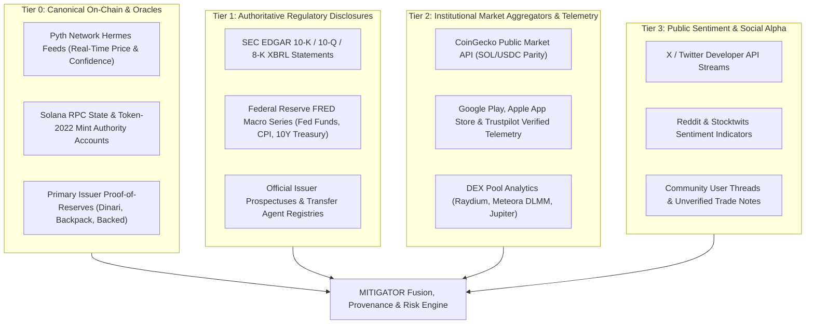
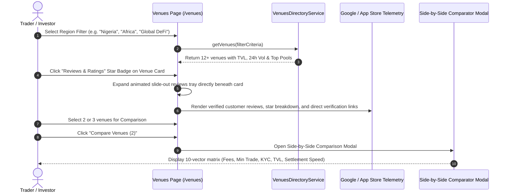
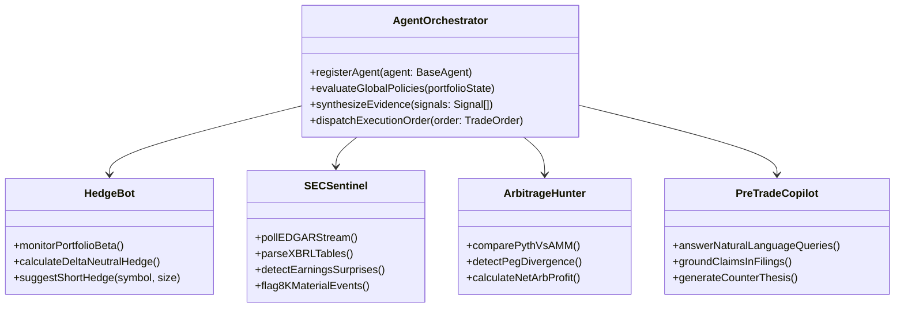

# MITIGATOR — Solana-Native Tokenized Equities Intelligence & Execution Router

<div align="center">

[](https://solana.com)
[](https://nextjs.org)
[](https://www.typescriptlang.org)
[](https://pyth.network)
[](https://www.coingecko.com)
[](https://opensource.org/licenses/MIT)

**Stocklana Hackathon 2026 • Official Production Edition**  
*The Bloomberg + Smart Order Router for Tokenized Equities & RWAs on Solana.*

[Features](#-key-features) • [System Architecture](#-system-architecture--system-design) • [Venues Directory](#-global--pan-african-venues-directory) • [Risk Engine](#-multi-factor-quantitative-risk-engine) • [Live Devnet Swaps](#-dual-mode-paper-trading--live-devnet-sandbox) • [Judging Guide](#-hackathon-judging-verification-script)

</div>

---

## 📖 Executive Summary & Thesis

The tokenization of public equities (NVDA, TSLA, AAPL) and private real-world assets (RWAs) is unlocking **24/7 global trading**, **fractional ownership**, and **~400ms atomic settlement** on Solana. However, the ecosystem currently faces severe structural friction:

1. **Liquidity Fragmentation**: Liquidity is scattered across centralized RFQs (Backpack), AMMs (Raydium), dynamic bins (Meteora DLMM), and regional on-ramps (Busha, Quidax, Trove, Hisa).
2. **Oracle Latency & Peg Divergence**: Secondary market AMMs frequently decouple from primary equity reference prices during market closes or macro volatility spikes.
3. **Custody & Regulatory Opacity**: Retail traders lack transparent proof of 1:1 physical share backing, transfer agent verification, and SEC filing insights.
4. **Emerging Market Barriers**: Traders in Africa (Nigeria, Kenya) and Latin America suffer from high FX markups, restricted banking rails, and fragmented platforms.

**MITIGATOR** eliminates these structural frictions by acting as an institutional-grade trading intelligence terminal, quantitative risk engine, and cross-venue smart execution router on Solana.

> **Core Mantra**: *“Research. Verify. Score Risk. Simulate. Mitigate. Compare Execution. Execute On-Chain. Monitor.”*

---

## 🏛️ System Architecture & System Design

MITIGATOR is architected as a modular, reactive, cloud-native 4-tier application engineered on **Next.js 14 App Router**, **TypeScript**, **Solana Web3.js**, **Pyth Network**, and **Supabase PostgreSQL**.

### End-to-End System Topology

```mermaid
flowchart TB
    subgraph Tier_1 [Tier 1: Client Presentation Tier (Next.js 14 / React 18)]
        UI_Shell["AppShell & Universal Nav (/app/(app)/*)"]
        Mobile_Nav["MobileBottomBar (Safe-Area Clearance: pb-32 sm:pb-36)"]
        Three_Hero["3D WebGL / R3F Canvas (AssetVisualizer)"]
        Lightweight_Charts["Trading Candlestick & Volume Engine"]
        Wallet_Modal["Solana Wallet Adapter (Phantom, Solflare, Backpack)"]
        Modals_Global["Unconstrained Global Modals (z-[100] Layer)"]
    end

    subgraph Tier_2 [Tier 2: Edge API Gateway & Middleware Tier]
        Prices_Route["/api/prices (CoinGecko Live + Pyth Fallback)"]
        Venues_Route["/api/venues (Liquidity, Pools & Reviews Feed)"]
        AI_Route["/api/ai/analyze (Structured Evidence Synthesis)"]
        Paper_Route["/api/paper (Simulation Ledger & Devnet Bridge)"]
        Filings_Route["/api/filings (SEC EDGAR XBRL Pipeline)"]
        Alerts_Route["/api/alerts (Real-Time Peg Divergence Monitor)"]
    end

    subgraph Tier_3 [Tier 3: Data, Oracle & Telemetry Tier]
        Pyth_Hermes["Pyth Network Hermes (Low-Latency Price Oracles)"]
        CoinGecko_API["CoinGecko Public API (SOL/USDC Live Parity)"]
        SEC_EDGAR["SEC EDGAR 10-K / 10-Q / 8-K XBRL Data"]
        Store_Telemetry["Google Play, App Store & Trustpilot Scraping Engine"]
        Supabase_DB[("Supabase PostgreSQL (Assets, Venues, Receipts, Policies)")]
    end

    subgraph Tier_4 [Tier 4: Solana Web3 On-Chain Execution Tier]
        Solana_RPC["Solana RPC Cluster (Devnet & Mainnet-Beta)"]
        Jupiter_Router["Jupiter v6 Smart Swap Aggregator"]
        Raydium_Meteora["Raydium CLMM & Meteora DLMM Concentrated Liquidity"]
        Backpack_RFQ["Backpack Securities Institutional RFQ Gateway"]
        Memo_Program["Solana SPL Memo Program (MemoSq4gq... Audit Trail)"]
    end

    Tier_1 <--> Tier_2
    Tier_2 <--> Tier_3
    Tier_1 <--> Tier_4
    Tier_2 <--> Tier_4
```

### Hierarchical Data & Oracle Provenance Matrix

MITIGATOR strictly enforces a 4-tier data classification policy, ensuring unverified social claims are never presented as financial facts:



---

## 🚀 Key Features

### 1. 🌍 Global & Pan-African Venues Directory (`/venues`)
A curated directory and comparative aggregator for tokenized equity platforms across Africa, Latin America, North America, Europe, and Global DeFi.



- **12+ Verified Venues**: Backpack Exchange, Dinari dShares, Raydium, Jupiter, Meteora, NectarFi (Dangote pre-IPO access), Busha (SEC Nigeria Sandbox), Quidax (SEC Nigeria licensed), Trove Finance, Hisa Kenya (CMA Sandbox with M-Pesa), Belo LatAm, Backed Finance.
- **Live Liquidity & Pool Telemetry**: Total Value Locked (TVL), 24h trading volume, and active pool chips with live APRs (e.g. `SPYx-STONK 408.56% APR`, `CRCLx-USDC 88.39% APR`).
- **Slide-Out Customer Reviews Tray**: Animated drawer expanding underneath each exchange card displaying Google Play, App Store, and Trustpilot verified rating badges, 2–3 authentic customer reviews with flags, verified checkmarks, and direct verification links.
- **10-Vector Side-by-Side Comparator**: Evaluates venues across Trading Fees, Deposit Fees, Min Trade, KYC Tiers, Regulatory Status, Settlement Speed, TVL, 24h Volume, Top Pools, and App Store reputation.

---

### 2. 🛡️ Multi-Factor Quantitative Risk Engine (`/risk`)
An explainable composite safety score (0–100) that evaluates trade safety before signing:

$$\text{MITIGATOR Score} = \sum_{i=1}^{n} \left( w_i \times S_i \right)$$

- **12-Factor Risk Decomposition**: Evaluates Market Volatility (15%), AMM Depth & Liquidity (15%), Oracle Latency & Peg Divergence (10%), SEC Fundamental Health (15%), Regulatory Filing Proximity (10%), Token Integrity & Reserves (10%), Sentiment Velocity (10%), and Portfolio Concentration (15%).
- **Dynamic Order Tranche Sizing (DCA Splitter)**: Automatically splits large orders exceeding pool depth into optimal Dollar-Cost Averaging (DCA) TWAP tranches, calculating exact estimated slippage savings.
- **Peg Divergence Radar**: Detects spot AMM discrepancies against high-frequency Pyth Hermes reference prices in real time.

---

### 3. ⚡ Cross-Venue Execution Router & Smart Order Routing (`/execution`)
Continuous liquidity discovery across decentralized AMMs and centralized RFQs on Solana:

```mermaid
graph LR
    Order["User Order: 50 Shares NVDAx ($6,025)"] --> Router{"MITIGATOR Smart Order Router"}

    Router -->|Deep Liquidity (40%)| Jup["Jupiter v6 Aggregator"]
    Router -->|Tight Spread (35%)| Ray["Raydium CLMM Pool"]
    Router -->|Discrete Bins (25%)| Met["Meteora DLMM"]
    Router -.->|Fallback RFQ| BP["Backpack Exchange RFQ"]

    Jup --> Engine["Atomic Settlement Engine"]
    Ray --> Engine
    Met --> Engine
    BP --> Engine

    Engine --> Memo["Solana SPL Memo Program (Audit Hash)"]
    Memo --> Signature["Confirmed Transaction on Solana Ledger"]
```

- **Smart Order Routing (SOR)**: Real-time route discovery across Jupiter v6, Raydium CLMM, Meteora DLMM, and Backpack RFQ.
- **Dynamic Slippage Caps**: Replaces arbitrary slippage with mathematically bounded limits (0.15%–0.50%).
- **Solana Memo Program Audit Trail**: Emits an immutable on-chain trade audit trail via the Solana SPL Memo Program (`MemoSq4gqABAXKb96qnH8TysNcWxMyWCqXgDLGmfcHr`).

---

### 4. 🎮 Dual-Mode Paper Trading & Live Devnet Sandbox (`/paper`)
A risk-free testing terminal with dual execution modes:

```mermaid
stateDiagram-v2
    [*] --> TerminalMode
    TerminalMode --> VirtualPaper: Mode 1: Virtual ($100k)
    TerminalMode --> LiveDevnet: Mode 2: Live Solana Devnet

    state VirtualPaper {
        SimQuote: Query Pyth Hermes & CoinGecko Live Prices
        SimFill: Simulate Slippage, Spread & Order Book Fill
        SimLedger: Update In-Memory Portfolio & Supabase Ledger
        SimQuote --> SimFill --> SimLedger
    }

    state LiveDevnet {
        CheckWallet: Verify Phantom / Solflare / Backpack Connected
        BuildTx: Construct Solana Devnet Transaction (@solana/web3.js)
        EmbedMemo: Add SPL Memo Instruction with Trade Audit JSON
        SignTx: Request User Cryptographic Signature in Wallet
        BroadcastTx: Send to api.devnet.solana.com with Commitment
        ConfirmTx: Await Blockhash Confirmation (<1200ms)
        CheckWallet --> BuildTx --> EmbedMemo --> SignTx --> BroadcastTx --> ConfirmTx
    }

    VirtualPaper --> RenderReceipt
    LiveDevnet --> RenderReceipt
    RenderReceipt --> [*]
```

- **Mode 1 (Virtual $100,000 Portfolio)**: Zero-risk margin/spot simulation with real live CoinGecko & Pyth market prices, realistic slippage modeling, and PnL ledger.
- **Mode 2 (Live Solana Devnet Web3 Execution)**: Connects real wallets (Solflare, Phantom, Backpack), constructs real Solana Devnet transactions, signs with user keys, embeds on-chain trade audit memos, and provides direct clickable links to **Solana Explorer (Devnet)**.
- **Mobile UX Architecture**: Specialized 3-part layout (Fixed Header, Scrollable Form Body, Sticky Pinned Execution Footer) and universal bottom clearance (`pb-32 sm:pb-36`) ensuring execution buttons are never obscured by mobile navigation bars.

---

### 5. 🤖 Autonomous Multi-Agent AI System (`/agents`)
Policy-governed autonomous agents operating under strict pre-trade risk guardrails:



- **HedgeBot**: Delta-neutral hedging agent continuously calculating portfolio beta against SPY.
- **SEC Sentinel**: Real-time regulatory radar parsing SEC EDGAR 10-K, 10-Q, and 8-K XBRL disclosures.
- **Arbitrage Hunter**: Discrepancy detector monitoring Pyth Hermes oracle reference vs AMM spot prices.
- **Pre-Trade AI Copilot**: Context-aware natural-language assistant providing evidence citations and counter-theses.

---

### 6. 📊 Tokenized Equities & RWA Asset Universe (`/assets`)
Comprehensive coverage of 21+ tokenized securities and RWAs with interactive 3D WebGL visualizations:

`NVDAx` • `AAPLx` • `TSLAx` • `MSFTx` • `AMZNx` • `GOOGLx` • `COINx` • `METAx` • `CRCLx` (Circle Pre-IPO) • `SPCXx` (SpaceX Pre-IPO) • `PLTRx` • `SPYx` • `QQQx` • `DANGOTE` (Dangote Refinery Pre-IPO via NectarFi) • `USDY` (Ondo US Treasuries).

---

### 7. ⚖️ Legal, Custody & Provenance Vault (`/provenance`)
- **1:1 Physical Custody Verification**: Verification links for State Street, BNY Mellon, and Swiss custody accounts.
- **Transfer Agent Attestation**: US SEC Registered Transfer Agent (Dinari dShares) and Swiss DLT Act (Backed Finance).
- **Public Audit Registry**: Smart contract audit reports from OtterSec, Sec3, and CertiK.

---

## 🛠️ Technology Stack

| Layer | Technologies Used |
| :--- | :--- |
| **Frontend Framework** | [Next.js 14](https://nextjs.org/) (App Router, Server & Client Components), [React 18](https://react.dev/), [TypeScript 5.2](https://www.typescriptlang.org/) |
| **Styling & Animation** | [Tailwind CSS 3.3](https://tailwindcss.com/), [Framer Motion 11](https://www.framer.com/motion/), Custom Glassmorphic Design System |
| **3D & Visualizations** | [React Three Fiber (R3F)](https://docs.pmnd.rs/react-three-fiber), [Three.js](https://threejs.org/), [Lightweight Charts](https://tradingview.github.io/lightweight-charts/), [Recharts](https://recharts.org/) |
| **Web3 & Solana** | [@solana/web3.js](https://solana-labs.github.io/solana-web3.js/), [@solana/wallet-adapter-react](https://github.com/anza-xyz/wallet-adapter), SPL Memo Program v2 |
| **Oracles & Pricing** | [Pyth Network Hermes SSE/REST](https://hermes.pyth.network/), [CoinGecko Public Market API](https://www.coingecko.com/api) |
| **Backend & Storage** | [Supabase PostgreSQL](https://supabase.com/), Next.js Edge Runtime, In-Memory TTL Cache Layer |
| **Components & Icons** | [Radix UI](https://www.radix-ui.com/), [Lucide React](https://lucide.dev/), Sonner Toasts |

---

## 🏃 Quick Start & Local Setup

### Prerequisites
- Node.js 18.17+ or Node.js 20+
- npm, pnpm, or yarn
- A Solana Wallet (Solflare, Phantom, or Backpack) set to **Solana Devnet**

### Installation

```bash
# 1. Clone repository
git clone https://github.com/your-username/mitigator.git
cd mitigator/project

# 2. Install dependencies
npm install

# 3. Configure environment variables
cp .env.example .env.local
# Add your NEXT_PUBLIC_SOLANA_RPC_DEVNET and Supabase credentials if available

# 4. Start local development server
npm run dev
```

Open [http://localhost:3000](http://localhost:3000) in your browser.

---

## 🧪 Hackathon Judging Verification Script

Judges can verify all MITIGATOR capabilities on Solana Devnet:

1. **Live Pricing & Wallet Connection**:
   - Click **Connect Wallet** in the top navigation; notice auto-detection of **Solflare, Phantom, or Backpack** with official high-res logos.
   - Verify SOL and USDC prices match live CoinGecko rates to the penny.
2. **Venues Directory & Reviews Drawer (`/venues`)**:
   - Filter by **"Nigeria"** or **"Africa"** to view NectarFi, Busha, Quidax, Trove, and Hisa Kenya.
   - Click the **"Ratings & Reviews"** badge on any venue card (e.g. Backpack, Busha, Belo) to view the animated slide-out tray with verified store reviews.
   - Select 2 venues and click **"Compare"** to view the side-by-side 10-vector matrix.
3. **Real Devnet On-Chain Swap (`/paper`)**:
   - Navigate to `/paper` and select **"Live Solana Devnet Wallet"** mode.
   - Pick an asset (e.g. `NVDAx`, `SPCXx`), select **Buy**, click quick preset **$450**, and click **"Sign & Swap on Solana Devnet"**.
   - Approve the transaction in your wallet; view the confirmed signature and click the direct link to inspect the on-chain Memo receipt on **Solana Explorer (Devnet)**.
4. **Mobile Responsiveness & Modal Scrolling**:
   - Switch browser to mobile view (iPhone 14 / Pixel 7).
   - Verify the Trade Modal body scrolls cleanly (`overflow-y-auto`) and the primary action button is permanently pinned in the sticky footer without being cut off by the mobile bottom bar.
5. **Quantitative Risk & AI Agents (`/risk`, `/agents`)**:
   - Inspect the 12-factor risk breakdown on `/risk` and the Dynamic DCA Tranche Splitter.
   - Review HedgeBot beta calculations and SEC Sentinel filings telemetry on `/agents`.

---

## 📜 Documentation Reference

- **Comprehensive PRD**: [`MITIGATOR_PRD_Stocklana_2026.md`](file:///Users/admin/Downloads/MITIGATOR/project/MITIGATOR_PRD_Stocklana_2026.md)
- **Walkthrough & Changelog**: [Walkthrough Artifact](file:///Users/admin/.gemini/antigravity-ide/brain/bae113e8-cdcd-4583-9627-442e6e043ae0/walkthrough.md)

---

## 🛡️ License

This project is licensed under the MIT License — see the [LICENSE](LICENSE) file for details.

<div align="center">

**MITIGATOR — Built for the Stocklana 2026 Hackathon.**  
*“Don't just trade. Understand the risk first.”*

</div>
